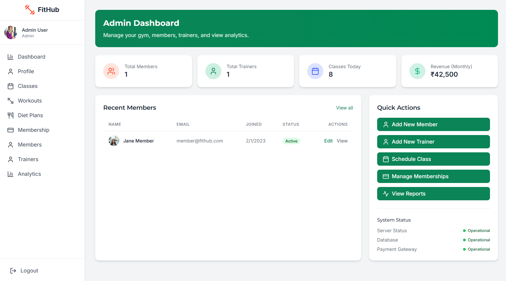

# 🏋️‍♂️ Gym Management System (AI-Generated)

A full stack **Gym Management System** project created using **Bolt AI**. This project was built purely for fun and to experiment with AI-generated application development. It demonstrates a simple gym management workflow including member registration, workout plans, class schedules, and more.

---

## 📖 Table of Contents

- [About the Project](#about-the-project)
- [Features](#features)
- [Tech Stack](#tech-stack)
- [Installation](#installation)
- [Usage](#usage)
- [Disclaimer](#disclaimer)
- [Screenshots](#screenshots)
- [License](#license)
- [Acknowledgements](#acknowledgements)

---

## 📌 About the Project

This is a fun and experimental Gym Management System built with the help of **Bolt AI**. The idea was to see how AI can assist in generating a basic full stack application structure and functionalities for gym management.

It includes the essential features a small gym might need, but was not intended for production use.

---

## ✨ Features

- Member Registration and Management  
- Membership Plans and Details  
- Class Scheduling and Management  
- Workout Tracking (Basic)  
- Dashboard Overview  

---

## 🛠️ Tech Stack

**Frontend:**  
- HTML, CSS, JavaScript  
- React / Angular / Vanilla JS (depending on AI generation)

**Backend:**  
- Node.js  
- Express.js  

**Database:**  
- MongoDB / MySQL  

**AI Tool:**  
- Bolt AI  

---

## 🖥️ Installation

Follow these steps to run the project locally:

1. **Clone the repository**
    ```
    git clone https://github.com/yourusername/gym-management-system.git
    ```

2. **Navigate to the project folder**
    ```
    cd gym-management-system
    ```

3. **Install backend dependencies**
    ```
    npm install
    ```

4. **Start the backend server**
    ```
    npm start
    ```

5. **Open your browser and visit**
    ```
    http://localhost:3000
    ```

---

## ▶️ Usage

This project serves as a reference or demo for AI-generated applications. You can explore, customize, and enhance it based on your own requirements or use it as a learning base.

---

## ⚠️ Disclaimer

This Gym Management System was created purely for experimentation using Bolt AI. It’s not optimized for production or commercial deployment and may contain incomplete logic or placeholder content. Use it at your own discretion.

---

## 📸 Screenshots

### Login Page

*Simple and secure login interface for all users.*

### Admin Dashboard

*Admin dashboard with management tools and statistics.*

### Trainer Dashboard

*Trainer dashboard for managing classes and tracking member progress.*

### User Dashboard

*User dashboard to view workout plans, schedules, and progress.*


---

## 📄 License

This project is licensed under the MIT License.  
Feel free to use, modify, and distribute it, but please note that this was an AI-generated experimental project.

---

## 🙌 Acknowledgements

- Bolt AI for generating the project structure and code.
- Open-source tools and libraries used within this project.
